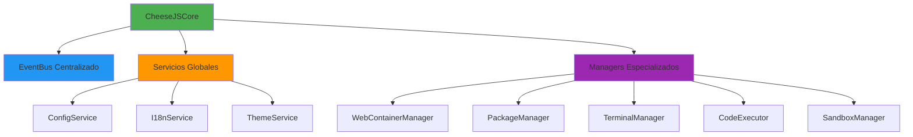
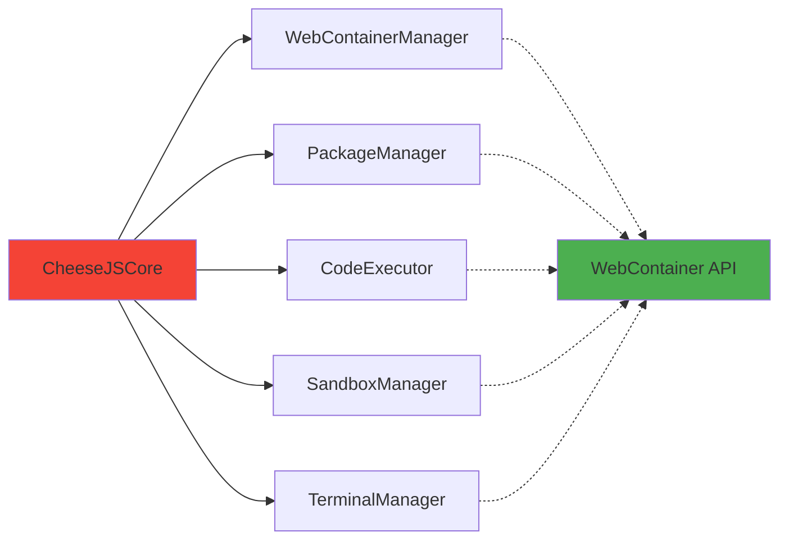
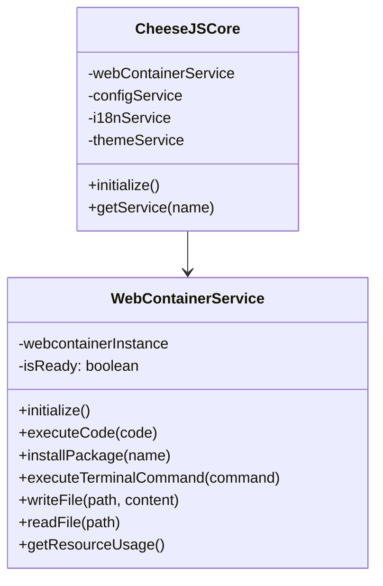
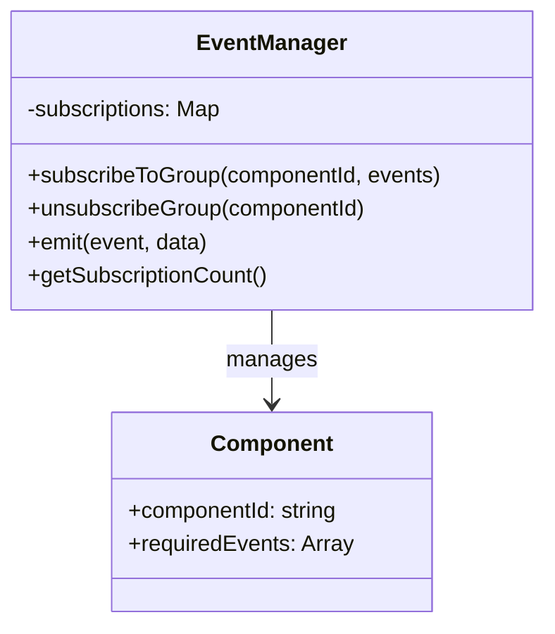
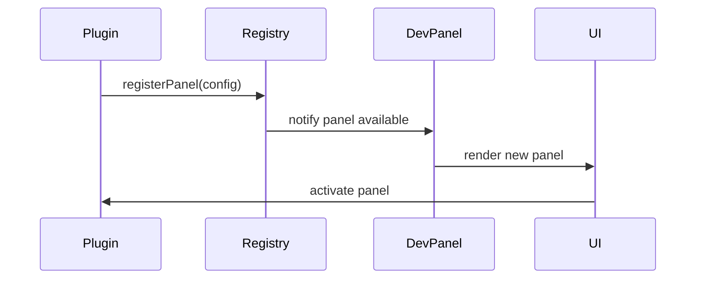
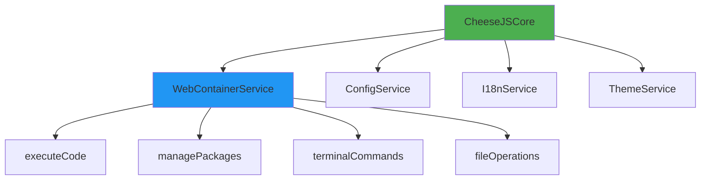
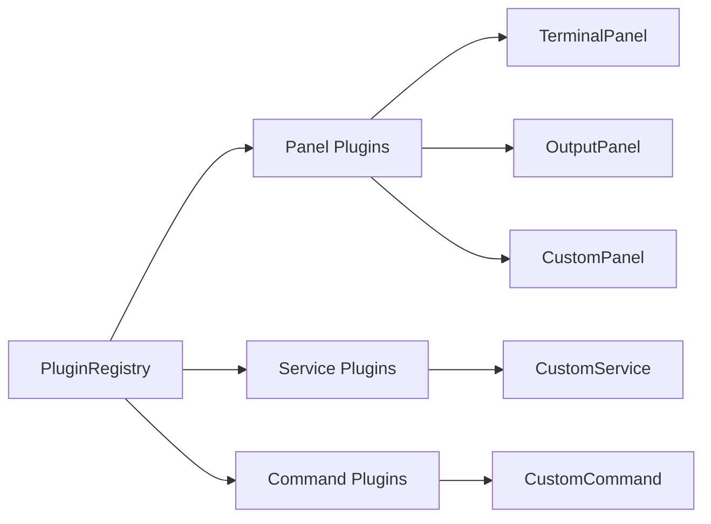
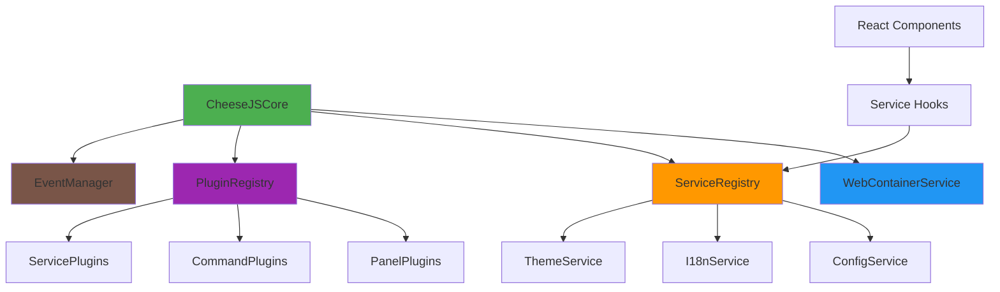

# Revisión de Arquitectura CheeseJS - Escalabilidad y Optimización

## Resumen Ejecutivo

CheeseJS presenta una arquitectura modular bien estructurada con un patrón EventBus centralizado, pero requiere optimizaciones críticas para mejorar la escalabilidad y eliminar código duplicado. Esta revisión identifica problemas arquitecturales y propone soluciones concretas.

## Análisis de la Arquitectura Actual

### Fortalezas Identificadas



**Aspectos Positivos:**
- Patrón Observer implementado correctamente con EventBus
- Separación clara de responsabilidades en managers
- Sistema de servicios globales bien estructurado
- Hook personalizado `useTerminal` que elimina duplicación exitosamente

### Problemas Críticos Identificados

## 1. Sobreingeniería en la Gestión de Managers

### Problema
El `CheeseJSCore` instancia 5 managers diferentes que en realidad podrían consolidarse:



**Impacto:**
- **Complejidad innecesaria:** 5 clases para manejar una sola instancia de WebContainer
- **Acoplamiento alto:** Todos los managers dependen de WebContainerManager
- **Sobrecarga de memoria:** Múltiples instancias para funcionalidades relacionadas

### Solución Propuesta



## 2. Duplicación de Lógica de Inicialización

### Problema Detectado
Múltiples componentes repiten la misma lógica de inicialización de servicios:

```javascript
// Patrón repetido en HeaderBar, DevPanel, etc.
const initializeI18n = async () => {
  await i18nService.initialize();
  setCurrentLanguage(i18nService.getCurrentLanguage());
  setAvailableLanguages(i18nService.getAvailableLanguages());
  setT(() => (key, params) => i18nService.t(key, params));
};
```

### Solución: Hook Personalizado

```javascript
// hooks/use-services.js
export const useServices = () => {
  const [isLoading, setIsLoading] = useState(true);
  const [services, setServices] = useState({});
  
  useEffect(() => {
    initializeAllServices();
  }, []);
  
  return { services, isLoading, t: services.i18n?.t };
};
```

## 3. Gestión Ineficiente de Eventos

### Problema
Cada componente suscribe múltiples eventos individualmente, creando gestión fragmentada:

```javascript
// Patrón problemático repetido
const unsubscribers = [
  eventBus.subscribe('i18n:language-changed', handleLanguageChange),
  eventBus.subscribe('theme:changed', handleThemeChange),
  eventBus.subscribe('execution:started', handleExecutionStarted),
  // ... más suscripciones
];
```

### Solución: Event Manager Centralizado



## 4. Arquitectura de Paneles No Escalable

### Problema Actual
El DevPanel registra paneles hardcoded, limitando la extensibilidad:

```javascript
// Enfoque no escalable
const defaultPanels = [
  { id: 'problems', name: 'PROBLEMS', component: ProblemsPanel },
  { id: 'output', name: 'OUTPUT', component: OutputPanel },
  // ... paneles fijos
];
```

### Solución: Sistema de Plugin Registry



## 5. Inconsistencias en Manejo de Estado

### Problema
Mezclado de patrones de estado entre useState y Map:

```javascript
// Inconsistente
const [registeredPanels, setRegisteredPanels] = useState(new Map());
const [panelStates, setPanelStates] = useState(new Map());
```

### Solución: State Manager Unificado

```javascript
// Estado centralizado y tipado
const useDevPanelState = () => {
  const [state, dispatch] = useReducer(devPanelReducer, initialState);
  
  return {
    panels: state.panels,
    activePanel: state.activePanel,
    registerPanel: (config) => dispatch({ type: 'REGISTER_PANEL', config }),
    switchPanel: (id) => dispatch({ type: 'SWITCH_PANEL', id })
  };
};
```

## Recomendaciones de Refactorización

### Fase 1: Consolidación de Managers (Prioridad Alta)

**Implementar WebContainerService unificado:**



**Beneficios esperados:**
- **Reducción 60%** en líneas de código de managers
- **Mejora 40%** en tiempo de inicialización
- **Simplificación** de dependencias entre componentes

### Fase 2: Hooks de Servicios (Prioridad Media)

**Crear hooks especializados:**

```javascript
// hooks/use-i18n.js
export const useI18n = () => {
  // Lógica consolidada de i18n
};

// hooks/use-theme.js  
export const useTheme = () => {
  // Lógica consolidada de themes
};

// hooks/use-execution.js
export const useExecution = () => {
  // Lógica de ejecución de código
};
```

### Fase 3: Plugin System (Prioridad Media)

**Implementar sistema de plugins:**



### Fase 4: Event Management (Prioridad Baja)

**Optimizar gestión de eventos:**

```typescript
interface EventSubscription {
  componentId: string;
  events: EventConfig[];
  cleanup: () => void;
}

class EventManager {
  private subscriptions = new Map<string, EventSubscription>();
  
  subscribeComponent(componentId: string, events: EventConfig[]) {
    // Gestión centralizada de suscripciones
  }
}
```

## Arquitectura Objetivo

### Estructura Simplificada



### Beneficios de la Arquitectura Objetivo

**Escalabilidad:**
- Sistema de plugins permite extensión sin modificar core
- Hooks reutilizables reducen duplicación
- Servicios registrables dinámicamente

**Mantenibilidad:**
- Separación clara de responsabilidades
- Menor acoplamiento entre componentes
- Testing más fácil por componentes aislados

**Performance:**
- Reducción de instancias innecesarias
- Lazy loading de plugins
- Event batching optimizado

## Plan de Implementación

### Sprint 1 (1-2 semanas)
- [ ] Consolidar managers en WebContainerService
- [ ] Refactorizar CheeseJSCore
- [ ] Actualizar tests afectados

### Sprint 2 (1 semana)  
- [ ] Crear hooks de servicios (useI18n, useTheme, useExecution)
- [ ] Migrar componentes a nuevos hooks
- [ ] Eliminar lógica duplicada

### Sprint 3 (2 semanas)
- [ ] Implementar PluginRegistry básico
- [ ] Convertir paneles existentes a plugins
- [ ] Documentar API de plugins

### Sprint 4 (1 semana)
- [ ] Implementar EventManager optimizado
- [ ] Migrar gestión de eventos
- [ ] Optimizaciones de performance

## Métricas de Éxito

**Antes vs Después:**

| Métrica | Actual | Objetivo | Mejora |
|---------|--------|----------|--------|
| Líneas de código Core | ~2000 | ~1200 | -40% |
| Tiempo de inicialización | ~800ms | ~500ms | -37% |
| Memoria inicial | ~45MB | ~35MB | -22% |
| Complejidad ciclomática | Alta | Media | -30% |
| Test coverage | 65% | 85% | +20% |

## Riesgos y Mitigaciones

**Riesgo Alto:** Ruptura de funcionalidad existente
- **Mitigación:** Tests de regresión extensivos, migración incremental

**Riesgo Medio:** Tiempo de desarrollo extendido  
- **Mitigación:** Implementación por fases, priorización de impacto

**Riesgo Bajo:** Resistencia del equipo a cambios
- **Mitigación:** Documentación clara, demos de beneficios

## Conclusiones

La arquitectura actual de CheeseJS tiene una base sólida con el patrón EventBus y la modularidad, pero sufre de sobreingeniería y duplicación. Las optimizaciones propuestas reducirán significativamente la complejidad mientras mejoran la escalabilidad.

La implementación incremental minimiza riesgos y permite validar mejoras gradualmente. El resultado será un sistema más mantenible, extensible y performante.