# Mejora del Floating Toolbar - Diseño Técnico

## Descripción General

Esta mejora optimiza el **FloatingToolbar** eliminando duplicaciones de estilos, agregando traducciones completas, asegurando un diseño responsive óptimo, integración total con el sistema de temas, y migración de todas las acciones desde header-bar y editor-toolbar al toolbar flotante.

## Objetivos de la Mejora

### Problemas Actuales Identificados
- **Duplicación de estilos CSS** entre diferentes toolbars
- **Traducciones incompletas** en tooltips del floating toolbar
- **Acciones fragmentadas** distribuidas en header-bar, editor-toolbar y floating-toolbar
- **Inconsistencias en el diseño** con el sistema de temas
- **Ocupación de espacio subóptima** en diferentes tamaños de pantalla

### Objetivos Específicos
1. **Eliminar duplicación de estilos** entre editor-toolbar, header-toolbar y floating-toolbar
2. **Consolidar todas las acciones** en el floating toolbar
3. **Implementar traducciones completas** para todos los tooltips
4. **Optimizar integración con el sistema de temas**
5. **Mejorar diseño responsive** y ocupación de espacio

## Arquitectura del Sistema

### Componentes Afectados

```mermaid
graph TD
    A[FloatingToolbar] --> B[Acciones Principales]
    A --> C[Acciones Secundarias] 
    A --> D[Sistema de Temas]
    A --> E[Sistema i18n]
    
    B --> B1[Run/Stop]
    B --> B2[Nuevo Archivo]
    B --> B3[Guardar]
    B --> B4[Formatear Código]
    
    C --> C1[Paquetes]
    C --> C2[Ejemplos]
    C --> C3[Console Toggle]
    C --> C4[Configuración]
    C --> C5[Tema Toggle]
    C --> C6[Idioma]
    C --> C7[Ayuda]
    
    D --> D1[Variables CSS]
    D --> D2[Tema Claro/Oscuro]
    
    E --> E1[Traducciones ES]
    E --> E2[Traducciones EN]
```



### Migración de Acciones

#### Desde Editor Toolbar
- **Ejecutar código** (▶️ ya existe en floating)
- **Formatear código** (🎨 agregar al floating)
- **Guardar código** (💾 ya existe en floating)

#### Desde Header Bar  
- **Toggle Console** (🖥️ ya existe en floating)
- **Cambio de Tema** (🌙/☀️ ya existe en floating)
- **Cambio de Idioma** (🌍 agregar al floating)
- **Configuración** (⚙️ ya existe en floating)

## Diseño de Interfaces

### Estructura del FloatingToolbar Mejorado


### Acciones Reorganizadas

#### Acciones Principales (Siempre Visibles)
| Acción | Ícono | Shortcut | Tooltip Key | Origen |
|--------|-------|----------|-------------|---------|
| Run/Stop | `play`/`stop` | Ctrl+Enter | `toolbar.run`/`toolbar.stop` | Floating (existente) |
| Nuevo Archivo | `file` | Ctrl+N | `toolbar.newFile` | Floating (existente) |
| Guardar | `save` | Ctrl+S | `toolbar.save` | Floating (existente) |
| Formatear | `format` | Ctrl+Shift+F | `toolbar.format` | Editor (migrar) |

#### Acciones Secundarias (Dropdown)
| Acción | Ícono | Shortcut | Tooltip Key | Origen |
|--------|-------|----------|-------------|---------|
| Paquetes | `package` | - | `toolbar.packages` | Floating (existente) |
| Ejemplos | `code` | - | `toolbar.examples` | Floating (existente) |
| Console | `terminal` | Ctrl+\` | `toolbar.toggleConsole` | Floating (existente) |
| **Idioma** | `language` | - | `toolbar.language` | Header (migrar) |
| Tema | `theme` | - | `toolbar.toggleTheme` | Floating (existente) |
| Configuración | `settings` | - | `toolbar.settings` | Floating (existente) |
| Ayuda | `help` | F1 | `toolbar.help` | Floating (existente) |

## Integración con el Sistema de Temas

### Variables CSS Actualizadas

```css
/* Floating Toolbar Theme Variables */
.floating-toolbar {
  /* Base glassmorphism con mejor integración de temas */
  background: var(--surface-primary);
  backdrop-filter: blur(20px) saturate(180%);
  border: 1px solid var(--border-primary);
  box-shadow: var(--shadow-floating);
}

/* Dark theme adjustments */
[data-theme="dark"] .floating-toolbar__container {
  background: rgba(var(--surface-primary-rgb, 30, 30, 30), 0.85);
  border-color: var(--border-primary);
}

/* Responsive positioning with theme awareness */
.floating-toolbar--bottom-center {
  bottom: var(--spacing-lg);
  left: 50%;
  transform: translateX(-50%);
}
```

### Eliminación de Duplicaciones CSS

#### Estilos a Eliminar

1. **En `editor-toolbar.css`**:
   - `.editor-toolbar` → Eliminar completamente
   - `.editor-actions` → Migrar al floating toolbar
   - `.editor-btn` → Consolidar en sistema de componentes Button

2. **En `header-bar.css`**:
   - `.control-group` → Simplificar (solo breadcrumb)
   - `.dropdown-menu` → Usar diseño unificado del floating toolbar
   - `.header-button` → Reducir a elementos esenciales

## Sistema de Traducciones

### Nuevas Claves de Traducción

#### En Español (`es`)
```javascript
toolbar: {
  // Existentes (verificar)
  run: 'Ejecutar',
  stop: 'Detener', 
  newFile: 'Nuevo Archivo',
  save: 'Guardar',
  packages: 'Paquetes',
  examples: 'Ejemplos',
  toggleConsole: 'Toggle Consola',
  toggleTheme: 'Cambiar Tema',
  settings: 'Configuración',
  help: 'Ayuda',
  moreActions: 'Más Acciones',
  expand: 'Expandir',
  collapse: 'Colapsar',
  
  // Nuevas (agregar)
  format: 'Formatear Código',
  language: 'Cambiar Idioma',
  formatCodeShortcut: 'Ctrl+Shift+F',
  runCodeShortcut: 'Ctrl+Enter',
  saveFileShortcut: 'Ctrl+S', 
  newFileShortcut: 'Ctrl+N',
  toggleConsoleShortcut: 'Ctrl+`',
  helpShortcut: 'F1'
}
```

#### En Inglés (`en`)
```javascript
toolbar: {
  // Existentes (verificar)
  run: 'Run',
  stop: 'Stop',
  newFile: 'New File', 
  save: 'Save',
  packages: 'Packages',
  examples: 'Examples',
  toggleConsole: 'Toggle Console',
  toggleTheme: 'Toggle Theme',
  settings: 'Settings',
  help: 'Help',
  moreActions: 'More Actions',
  expand: 'Expand',
  collapse: 'Collapse',
  
  // Nuevas (agregar)
  format: 'Format Code',
  language: 'Change Language',
  formatCodeShortcut: 'Ctrl+Shift+F',
  runCodeShortcut: 'Ctrl+Enter',
  saveFileShortcut: 'Ctrl+S',
  newFileShortcut: 'Ctrl+N', 
  toggleConsoleShortcut: 'Ctrl+`',
  helpShortcut: 'F1'
}
```

## Optimización Responsive

### Breakpoints y Comportamiento

```css
/* Mobile First Approach */
@media (max-width: 768px) {
  .floating-toolbar {
    /* Ocupar ancho completo en mobile */
    left: var(--spacing-sm) !important;
    right: var(--spacing-sm) !important;
    bottom: var(--spacing-sm) !important;
    transform: none !important;
    width: calc(100% - calc(var(--spacing-sm) * 2));
  }
  
  .floating-toolbar__primary {
    /* Espaciado optimizado */
    gap: var(--spacing-sm);
  }
  
  .floating-toolbar__drag-handle {
    /* Ocultar drag handle en mobile */
    display: none;
  }
}

@media (max-width: 480px) {
  .floating-toolbar__separator {
    /* Ocultar separadores en pantallas muy pequeñas */
    display: none;
  }
  
  .floating-toolbar__primary {
    gap: var(--spacing-xs);
  }
}
```

### Estrategia de Ocupación de Espacio

1. **Desktop**: Toolbar flotante centrado en la parte inferior
2. **Tablet**: Ancho completo en la parte inferior con espaciado lateral
3. **Mobile**: Ancho completo pegado a los bordes
4. **Draggable**: Solo en desktop, posición personalizable con localStorage

## Implementación por Fases

### Fase 1: Limpieza de Duplicaciones
1. **Auditar estilos duplicados** entre toolbars
2. **Remover CSS redundante** de editor-toolbar y header-bar
3. **Consolidar variables** en el sistema de colores unificado

### Fase 2: Migración de Acciones
1. **Agregar acción "Formatear"** al floating toolbar
2. **Agregar selector de idioma** al dropdown
3. **Remover acciones migradas** de editor-toolbar y header-bar
4. **Actualizar event handlers** para nueva estructura

### Fase 3: Traducciones y UX
1. **Agregar todas las traducciones faltantes**
2. **Implementar tooltips con shortcuts**
3. **Mejorar feedback visual** en cambios de estado
4. **Optimizar animaciones** y transiciones

### Fase 4: Responsive y Temas
1. **Optimizar layout responsive**
2. **Verificar integración con temas**
3. **Testear accesibilidad**
4. **Validar usabilidad** en diferentes dispositivos

## Validación y Testing

### Criterios de Aceptación

#### Funcionalidad
- [ ] Todas las acciones consolidadas en floating toolbar
- [ ] Eliminación completa de duplicaciones CSS
- [ ] Traducciones completas en ES e IN
- [ ] Integración perfecta con sistema de temas
- [ ] Diseño responsive funcionando en todos los breakpoints

#### Rendimiento  
- [ ] CSS optimizado (sin duplicaciones)
- [ ] Carga de traducciones eficiente
- [ ] Animaciones fluidas en todos los dispositivos
- [ ] Memoria estable (sin memory leaks)

#### Accesibilidad
- [ ] Navegación por teclado completa
- [ ] Tooltips informativos con shortcuts
- [ ] Contraste adecuado en ambos temas
- [ ] Lectores de pantalla compatibles

#### UX/UI
- [ ] Posicionamiento intuitivo y no intrusivo
- [ ] Drag & drop funcionando correctamente
- [ ] Estados visuales claros (hover, active, disabled)
- [ ] Consistencia visual con design system

### Pruebas Específicas

#### Testing Manual
1. **Desktop**: Verificar drag & drop, tooltips, shortcuts
2. **Tablet**: Validar responsive, touch interactions  
3. **Mobile**: Confirmar usabilidad táctil, espaciado
4. **Temas**: Alternar entre claro/oscuro, verificar contraste
5. **Idiomas**: Cambiar entre ES/EN, verificar traducciones

#### Testing Automatizado
```javascript
// Ejemplo de test unitario
describe('FloatingToolbar Enhancement', () => {
  test('debe mostrar todas las acciones consolidadas', () => {
    // Verificar que todas las acciones estén presentes
  });
  
  test('debe aplicar tema correctamente', () => {
    // Verificar variables CSS de tema
  });
  
  test('debe mostrar traducciones correctas', () => {
    // Verificar textos en ES e IN
  });
});
```

## Métricas de Éxito

### Métricas Técnicas
- **Reducción de CSS**: Eliminar al menos 40% de estilos duplicados
- **Consolidación**: 100% de acciones migradas al floating toolbar
- **Cobertura i18n**: 100% de strings traducidos
- **Compatibilidad**: Funcional en todos los breakpoints definidos

### Métricas de UX
- **Accesibilidad**: Cumplir con WCAG 2.1 AA
- **Rendimiento**: Mantener 60fps en animaciones
- **Usabilidad**: Todas las acciones accesibles en máximo 2 clics
- **Consistencia**: 100% integración con design system
