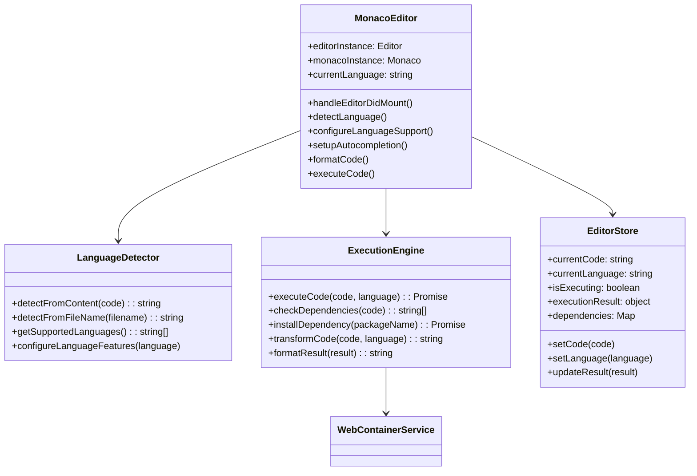
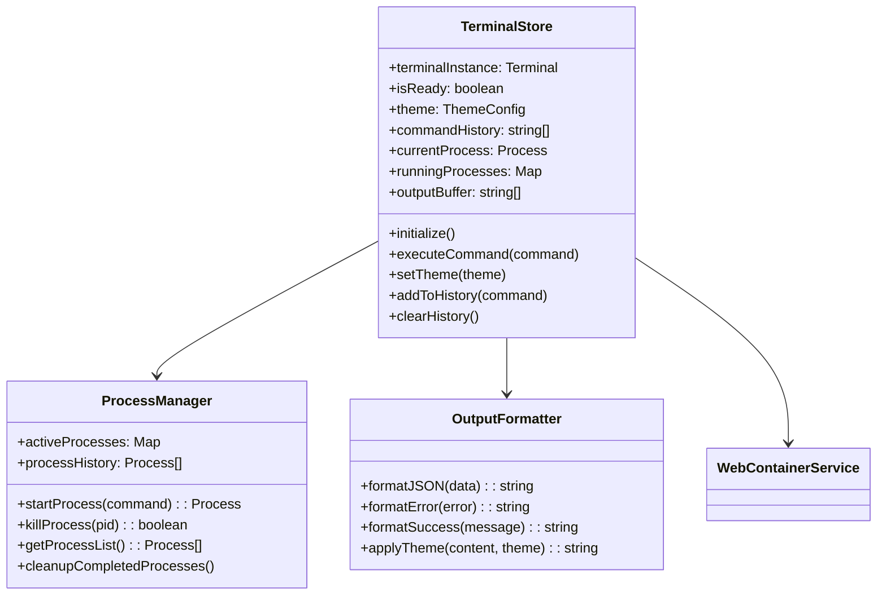
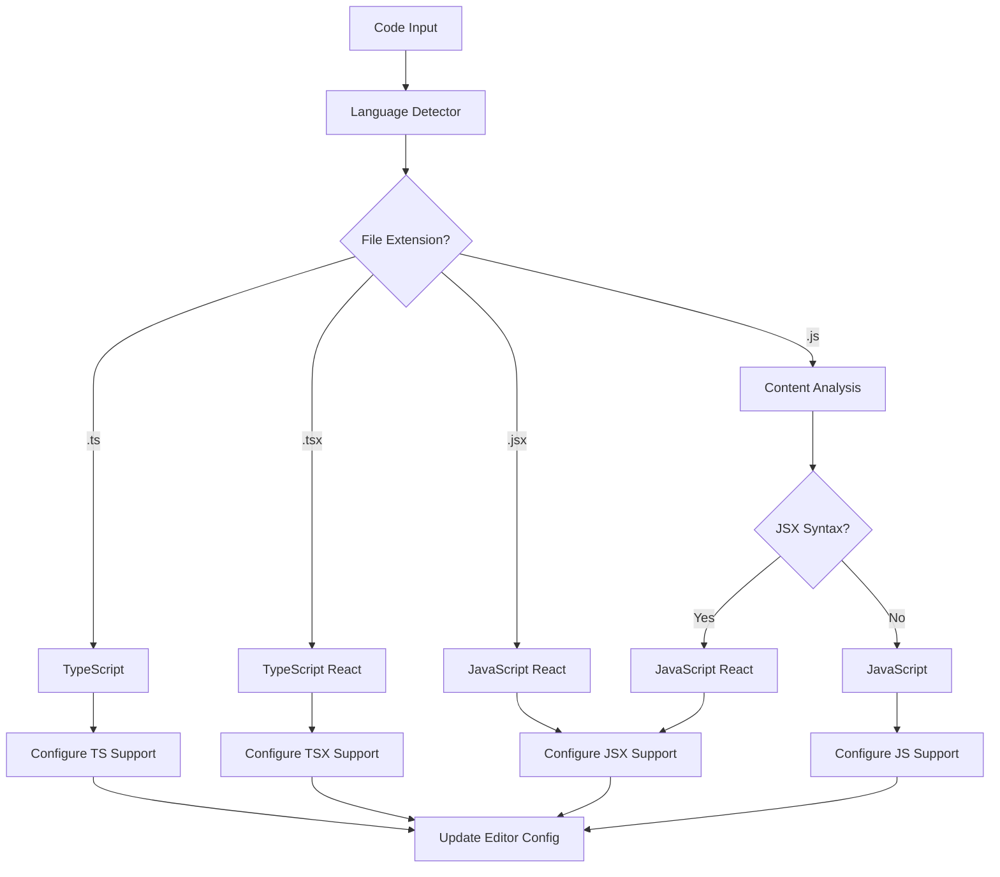
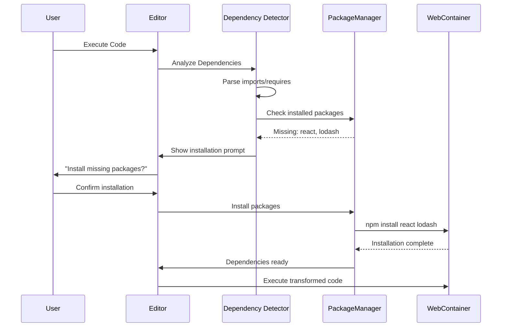
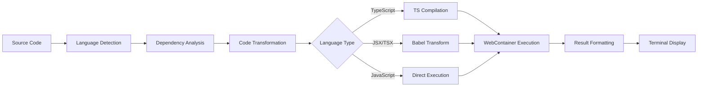
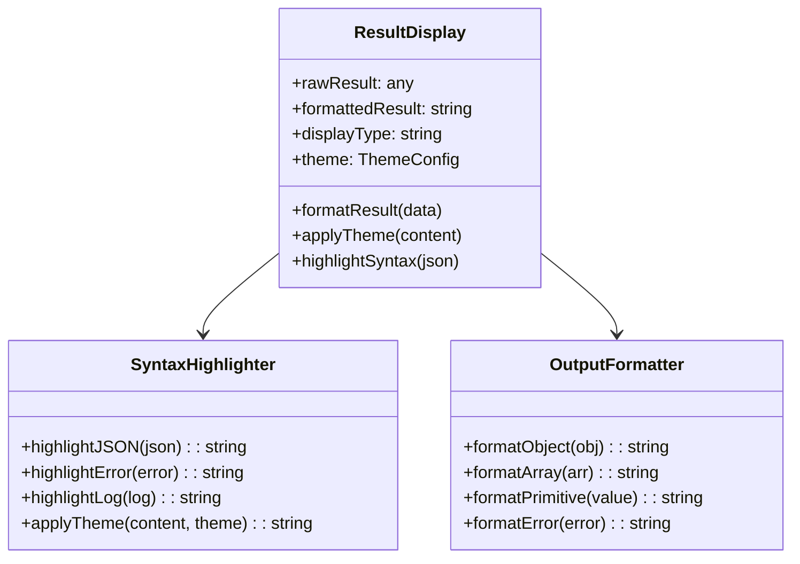
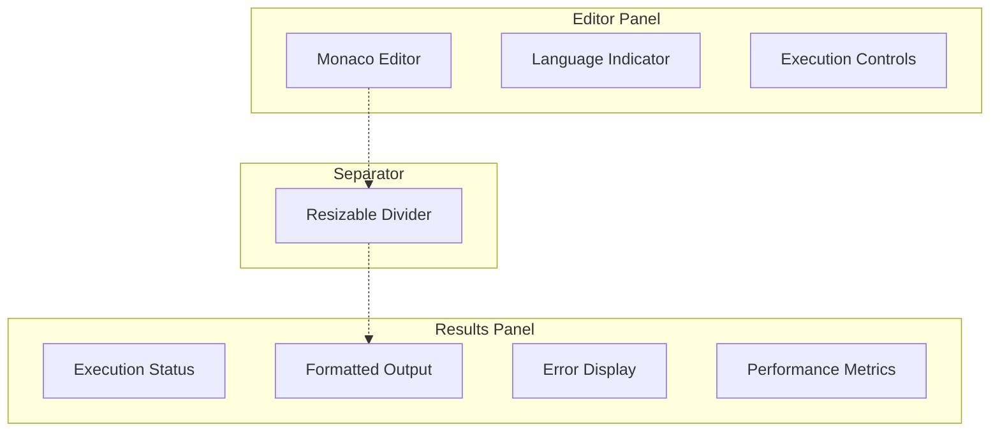
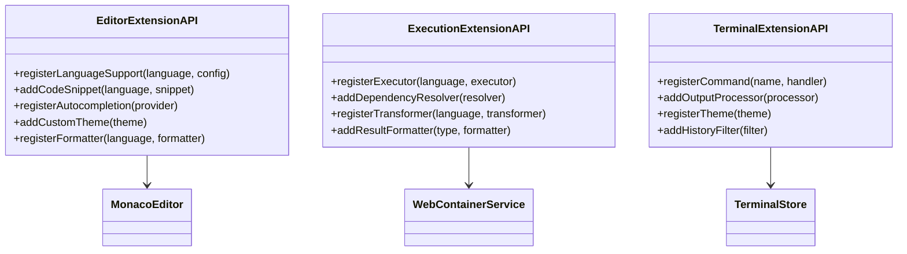
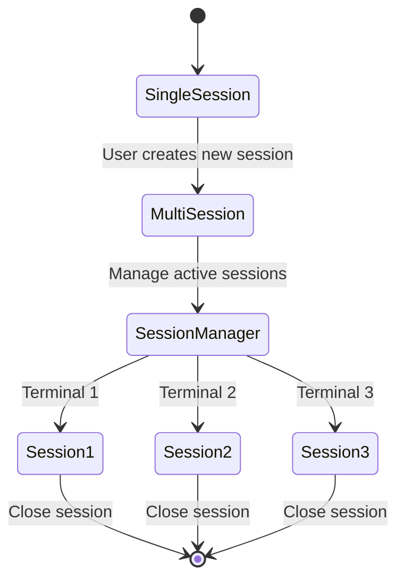
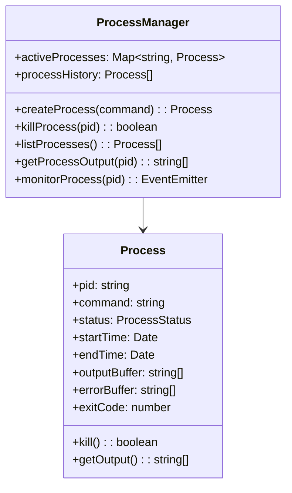

# Monaco-WebContainer Integration Enhancement

## Overview

This design document outlines the enhancement of the integration between Monaco Editor, WebContainer execution engine, and Zustand state management in CheeseJS. The goal is to create a seamless, modular development environment with automatic language detection, dynamic dependency management, and centralized theming without breaking the existing architecture.

### Key Enhancement Areas
- **Automatic Language Detection**: Dynamic language recognition for JavaScript, TypeScript, JSX, and TSX
- **Smart Execution Engine**: Context-aware code execution with dependency management
- **Unified State Management**: Complete migration from React state to Zustand stores
- **Enhanced Result Display**: JSON syntax highlighting with proper visual separation
- **Extensible Architecture**: Clean APIs for future integrations and plugins

## Technology Stack & Dependencies

### Current Dependencies
- **Monaco Editor**: `@monaco-editor/react ^4.7.0` for code editing
- **WebContainer**: `@webcontainer/api ^1.6.1` for code execution
- **State Management**: `zustand ^5.0.8` for centralized state
- **XTerm**: `@xterm/xterm ^5.5.0` for terminal interface

### New Dependencies Required
- **Language Detection**: `@monaco-editor/loader` for dynamic language configuration
- **TypeScript Support**: `typescript` for TS/TSX execution
- **Code Transformation**: `@babel/standalone` for JSX transformation
- **Module Bundling**: `esbuild-wasm` for client-side compilation
- **Code Formatting**: `prettier` for result formatting
- **Type Definitions**: `@types/node` for enhanced autocompletion

## Component Architecture

### Enhanced Monaco Editor Architecture



### Enhanced Terminal Store Architecture



## Language Detection & Configuration

### Automatic Language Detection System



### Language Configuration Matrix

| Language | File Extensions | Compilation | Dependencies |
|----------|----------------|-------------|--------------|
| JavaScript | `.js` | None | Core WebContainer |
| TypeScript | `.ts` | TypeScript compiler | `typescript` |
| JSX | `.jsx` | Babel transform | `@babel/standalone`, `react` |
| TSX | `.tsx` | TypeScript + JSX | `typescript`, `react` |

## Execution Engine Enhancement

### Smart Dependency Detection



### Code Transformation Pipeline



## State Management Migration

### Complete Zustand Migration Strategy

#### 1. Enhanced Terminal Store

```javascript
// Enhanced terminal-store.js structure
export const useTerminalStore = createBaseStore('TerminalStore', (set, get) => ({
  // Core terminal state
  terminalInstance: null,
  isReady: false,
  isExecuting: false,
  
  // Theme management (centralized)
  theme: {
    background: '#1e1e1e',
    foreground: '#d4d4d4',
    // ... complete theme object
  },
  
  // Process management
  runningProcesses: new Map(),
  processHistory: [],
  
  // Output management
  outputBuffer: [],
  formattedOutput: '',
  
  // Command history
  commandHistory: [],
  historyIndex: -1,
  
  // Actions
  setTheme: (newTheme) => set({ theme: newTheme }),
  executeCommand: async (command) => { /* implementation */ },
  addToHistory: (command) => { /* implementation */ },
  formatOutput: (data, type) => { /* implementation */ }
}));
```

#### 2. New Editor Store

```javascript
// New editor-store.js
export const useEditorStore = createBaseStore('EditorStore', (set, get) => ({
  // Editor state
  editorInstance: null,
  monacoInstance: null,
  isReady: false,
  
  // Code management
  currentCode: '',
  currentLanguage: 'javascript',
  currentFile: 'index.js',
  
  // Execution state
  isExecuting: false,
  executionResult: null,
  executionError: null,
  
  // Dependencies
  installedPackages: new Set(),
  missingDependencies: [],
  
  // Actions
  setCode: (code) => set({ currentCode: code }),
  setLanguage: (language) => set({ currentLanguage: language }),
  executeCode: async () => { /* implementation */ },
  detectLanguage: (code, filename) => { /* implementation */ }
}));
```

### Migration from React State

#### Current State (use-terminal.js) → Target State (terminal-store.js)

| Current React State | Target Zustand Store | Migration Strategy |
|-------------------|---------------------|-------------------|
| `useState(isConnected)` | `store.isReady` | Direct mapping |
| `useState(terminalReady)` | `store.terminalInstance !== null` | Computed state |
| `useState(commandHistory)` | `store.commandHistory` | Direct migration |
| `useState(currentInput)` | `store.currentInput` | Direct migration |
| Theme in `useTheme()` | `store.theme` | Centralize in terminal store |

## Result Display Enhancement

### JSON Syntax Highlighting System



### Visual Separation Design



## API Design for Extensibility

### Core Extension APIs



### Plugin Integration Points

| Extension Point | API Method | Use Case |
|----------------|------------|----------|
| Language Support | `registerLanguageSupport()` | Add new languages |
| Code Snippets | `addCodeSnippet()` | Insert code templates |
| Autocompletion | `registerAutocompletion()` | Custom completions |
| Code Execution | `registerExecutor()` | Custom execution logic |
| Result Formatting | `addResultFormatter()` | Custom output display |
| Terminal Commands | `registerCommand()` | Custom CLI commands |

## Advanced Terminal Features

### Multi-session Terminal System



### Process Management Interface



## Migration Implementation Strategy

### Phase 1: State Management Migration
1. **Complete terminal-store.js implementation**
   - Migrate all React state from use-terminal.js
   - Implement centralized theme management
   - Add process management capabilities

2. **Create editor-store.js**
   - Extract editor state from monaco-editor.jsx
   - Implement language detection state
   - Add execution state management

### Phase 2: Language Detection Implementation
1. **Language detector service**
   - File extension analysis
   - Content-based detection
   - Dynamic Monaco configuration

2. **Enhanced Monaco integration**
   - Automatic language switching
   - Language-specific features
   - TypeScript/JSX support

### Phase 3: Execution Engine Enhancement
1. **Dependency detection system**
   - Import/require analysis
   - Package availability checking
   - Installation prompting

2. **Code transformation pipeline**
   - TypeScript compilation
   - JSX transformation
   - Error handling

### Phase 4: Result Display Enhancement
1. **JSON syntax highlighting**
   - Theme-aware highlighting
   - Object exploration
   - Error formatting

2. **Visual improvements**
   - Clear editor-result separation
   - Responsive layout
   - Performance metrics

## Testing Strategy

### Unit Testing Coverage
- **Language Detection**: Test all supported file types and content patterns
- **State Management**: Test Zustand store actions and state transitions
- **Code Execution**: Test transformation and execution pipelines
- **Dependency Management**: Test package detection and installation

### Integration Testing
- **Monaco-WebContainer Integration**: End-to-end code execution flow
- **Theme Synchronization**: Verify theme consistency across components
- **Error Handling**: Test error states and recovery mechanisms
- **Performance**: Validate execution speed and memory usage