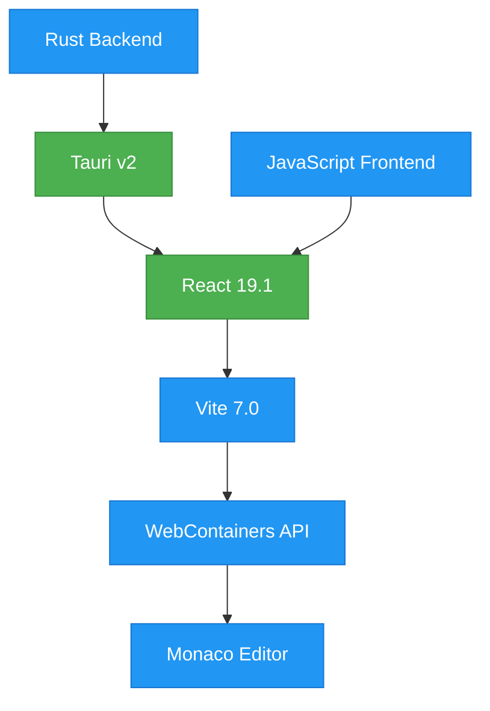
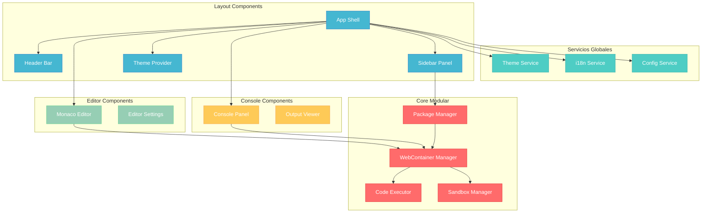
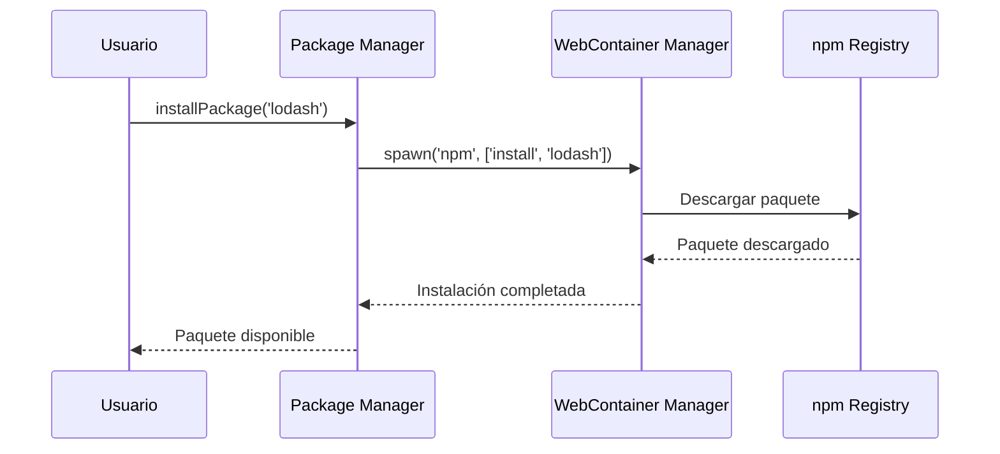
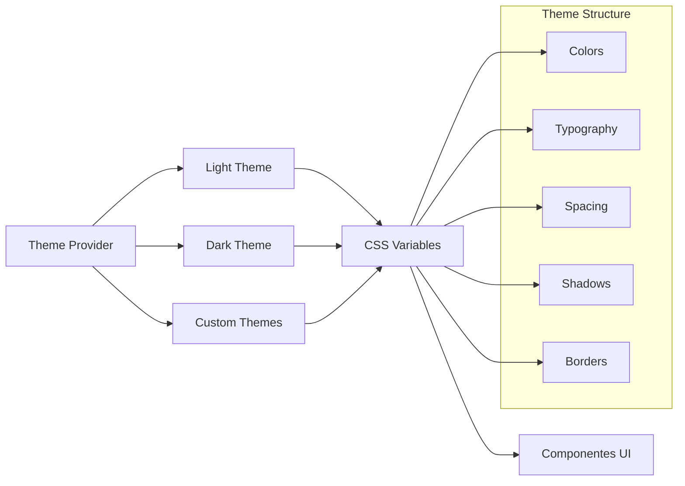
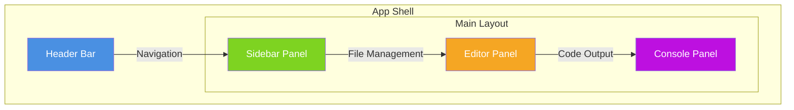
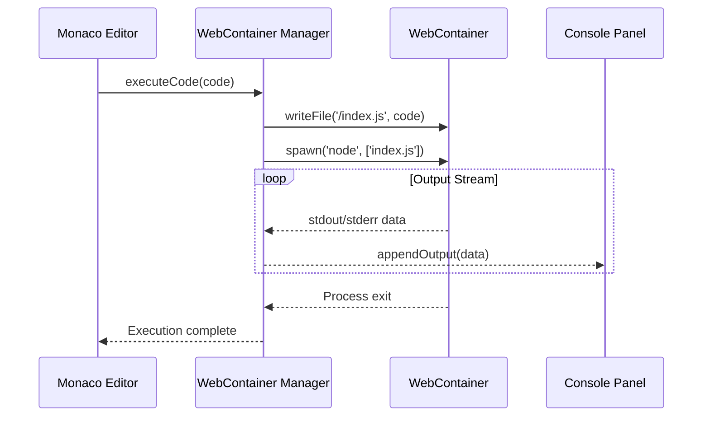
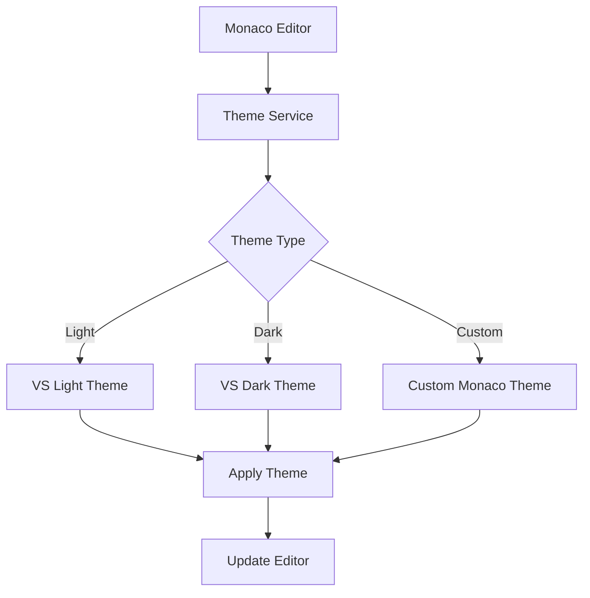
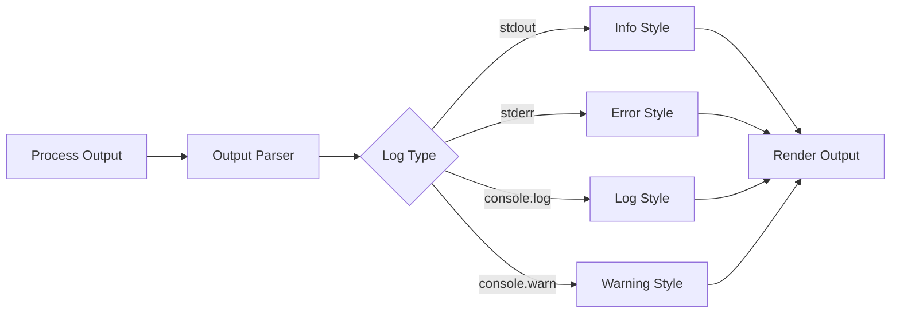
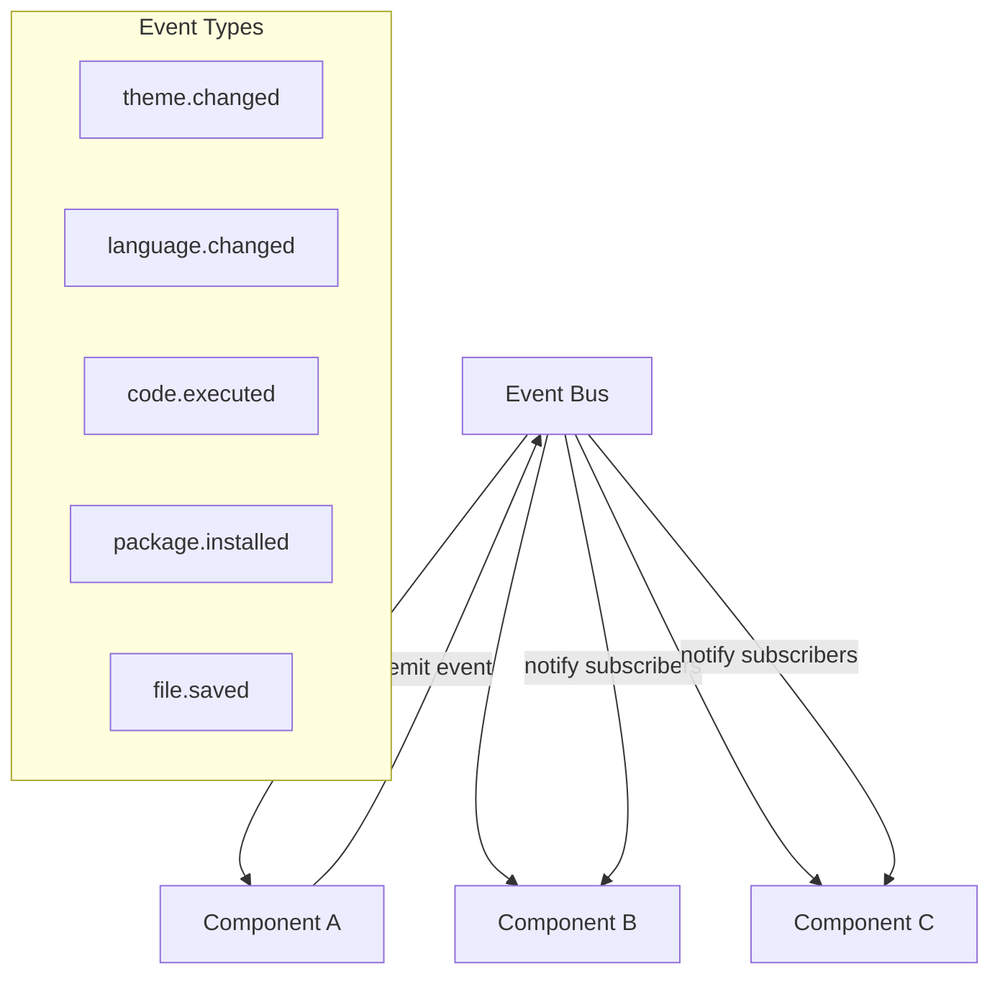

# Diseño Técnico: CheeseJS - Aplicación Similar a RunJS

## Visión General

CheeseJS es una aplicación de escritorio que proporciona un entorno de desarrollo JavaScript interactivo, similar a RunJS. La aplicación combina Tauri + React + WebContainers para ofrecer ejecución de código en tiempo real, gestión de paquetes npm, y un editor de código avanzado con Monaco Editor.

### Objetivos Principales

- **Core modular y escalable**: Núcleo desacoplado para fácil extensión
- **Layout temable**: Sistema completo de themes (light/dark/personalizables)
- **Internacionalización**: Soporte multiidioma desde el inicio
- **Ejecución de código**: Integración completa con WebContainers
- **Editor avanzado**: Monaco Editor con autocompletado y sintaxis highlighting

## Tecnología Stack & Dependencias

### Stack Principal


### Dependencias Clave
- **Frontend**: React 19.1, Monaco Editor, WebContainers API
- **Backend**: Tauri 2.0, Rust
- **Build Tools**: Vite 7.0, PostCSS, Tailwind CSS (futuro)
- **Desarrollo**: ESLint, Prettier, TypeScript (futuro)

## Arquitectura del Proyecto

### Estructura de Directorios
```
src/
├── core/                    # Núcleo modular del sistema
│   ├── webcontainer-manager.js   # Gestión de WebContainers
│   ├── package-manager.js        # Instalación/gestión de paquetes
│   ├── code-executor.js          # Ejecución de código
│   └── sandbox-manager.js        # Gestión del sandbox
├── services/                # Servicios globales
│   ├── theme-service.js          # Sistema de themes
│   ├── i18n-service.js           # Internacionalización
│   └── config-service.js         # Configuración
├── components/              # Componentes de UI
│   ├── layout/
│   │   ├── app-shell.jsx         # Contenedor principal
│   │   ├── header-bar.jsx        # Barra de encabezado
│   │   ├── sidebar-panel.jsx     # Panel lateral
│   │   └── theme-provider.jsx    # Proveedor de themes
│   ├── editor/
│   │   ├── monaco-editor.jsx     # Editor de código
│   │   └── editor-settings.jsx   # Configuración del editor
│   ├── console/
│   │   ├── console-panel.jsx     # Panel de consola
│   │   └── output-viewer.jsx     # Visualizador de salida
│   └── dialogs/
│       ├── settings-dialog.jsx   # Configuración global
│       └── package-dialog.jsx    # Gestión de paquetes
├── assets/                  # Recursos estáticos
│   ├── locales/             # Archivos de traducción
│   │   ├── es.json
│   │   ├── en.json
│   │   └── fr.json
│   ├── themes/              # Definiciones de themes
│   │   ├── light.css
│   │   ├── dark.css
│   │   └── custom.css
│   └── icons/               # Iconografía
└── utils/                   # Utilidades compartidas
    ├── event-bus.js              # Sistema de eventos
    ├── storage.js                # Persistencia local
    └── validators.js             # Validadores
```

### Arquitectura de Componentes



## Core Modular (Núcleo del Sistema)

### WebContainer Manager
**Responsabilidades:**
- Inicialización y gestión del WebContainer
- Configuración de headers COOP/COEP
- Montaje del sistema de archivos virtual
- Comunicación entre frontend y sandbox

**Interfaz Principal:**
```javascript
class WebContainerManager {
  async boot()                    // Inicializar WebContainer
  async mount(files)             // Montar archivos en el sandbox
  async writeFile(path, content) // Escribir archivo
  async readFile(path)           // Leer archivo
  spawn(command, args)           // Ejecutar comando
  on(event, callback)            // Escuchar eventos
}
```

### Package Manager
**Responsabilidades:**
- Instalación de paquetes npm
- Gestión de dependencias
- Cache de paquetes
- Resolución de versiones

**Flujo de Instalación:**


### Code Executor
**Responsabilidades:**
- Ejecución de código JavaScript
- Manejo de errores en tiempo de ejecución
- Streaming de output en tiempo real
- Gestión de procesos

### Sandbox Manager
**Responsabilidades:**
- Aislamiento del entorno de ejecución
- Gestión de recursos del sandbox
- Limpieza de procesos
- Monitoreo de rendimiento

## Layout + Sistema de Themes

### Theme Provider
**Arquitectura de Themes:**


**Definición de Theme:**
```css
:root {
  /* Colors */
  --primary-color: #007ACC;
  --secondary-color: #1E1E1E;
  --background-color: #FFFFFF;
  --surface-color: #F3F3F3;
  --text-color: #000000;
  --text-secondary: #666666;
  
  /* Editor */
  --editor-background: #FFFFFF;
  --editor-foreground: #000000;
  --editor-selection: #ADD6FF;
  --editor-line-highlight: #F0F0F0;
  
  /* Console */
  --console-background: #1E1E1E;
  --console-text: #FFFFFF;
  --console-error: #F44747;
  --console-warning: #FFCC02;
  --console-info: #007ACC;
}
```

### Layout Responsivo
**Estructura Base:**


**Layout Escalable:**
- **Grid System**: CSS Grid para layouts principales
- **Flexbox**: Para componentes internos
- **Responsive Breakpoints**: Mobile-first approach
- **Panel Resizing**: Drag & drop para redimensionar paneles

## Sistema de Internacionalización (i18n)

### Estructura de Traducciones
**Archivo de idioma (es.json):**
```json
{
  "header": {
    "run": "Ejecutar",
    "install": "Instalar Paquete",
    "settings": "Configuración",
    "theme": "Tema"
  },
  "editor": {
    "placeholder": "// Escribe tu código JavaScript aquí...",
    "save": "Guardar",
    "format": "Formatear",
    "autocomplete": "Autocompletar"
  },
  "console": {
    "clear": "Limpiar",
    "output": "Salida",
    "errors": "Errores",
    "warnings": "Advertencias"
  },
  "packages": {
    "install": "Instalar {{package}}",
    "installing": "Instalando...",
    "installed": "{{package}} instalado correctamente",
    "error": "Error al instalar {{package}}"
  }
}
```

### I18n Service
**Funcionalidades:**
- Carga dinámica de traducciones
- Interpolación de variables
- Pluralización
- Formateo de fechas/números por locale
- Fallback a idioma por defecto

```mermaid
graph LR
    A[i18n Service] --> B[Load Translations]
    B --> C[Set Language]
    C --> D[Interpolate Variables]
    D --> E[Format Output]
    
    F[Component] --> |t('key', params)| A
    A --> |Translated Text| F
```

## Ejecución de Código con WebContainers

### Configuración COOP/COEP
**Headers Requeridos:**
```javascript
// vite.config.js
export default defineConfig({
  server: {
    headers: {
      "Cross-Origin-Embedder-Policy": "require-corp",
      "Cross-Origin-Opener-Policy": "same-origin",
    },
  },
});
```

### Flujo de Ejecución


### Gestión de Archivos Virtuales
**File System Tree:**
```javascript
const files = {
  'package.json': {
    file: {
      contents: JSON.stringify({
        name: 'cheesejs-workspace',
        type: 'module',
        dependencies: {},
        scripts: {
          start: 'node index.js'
        }
      }, null, 2)
    }
  },
  'index.js': {
    file: {
      contents: '// Tu código aquí\nconsole.log("¡Hola CheeseJS!");'
    }
  }
};
```

## Editor de Código con Monaco

### Configuración del Editor
**Features Principales:**
- Syntax highlighting para JS/TS/JSX/TSX
- Autocompletado inteligente
- Error checking en tiempo real
- Code formatting
- Multiple cursors
- Find & replace

### Integración con Themes


### Autocompletado Personalizado
**Providers de Autocompletado:**
- **NPM Packages**: Sugerencias de paquetes instalados
- **Node.js APIs**: APIs nativas de Node.js
- **Custom Snippets**: Snippets definidos por el usuario
- **Context-aware**: Basado en imports y scope

## Consola de Salida

### Console Panel Features
- **Real-time Output**: Streaming de stdout/stderr
- **Log Levels**: Info, Warning, Error con colores
- **Filtering**: Filtros por tipo de log
- **Search**: Búsqueda en output
- **Clear**: Limpieza de consola
- **Copy**: Copiar output seleccionado

### Output Viewer


## Comunicación Entre Componentes

### Event Bus System
**Arquitectura de Eventos:**


### Patrón Observer
**Implementación:**
```javascript
class EventBus {
  constructor() {
    this.events = new Map();
  }
  
  subscribe(event, callback) {
    if (!this.events.has(event)) {
      this.events.set(event, []);
    }
    this.events.get(event).push(callback);
  }
  
  emit(event, data) {
    if (this.events.has(event)) {
      this.events.get(event).forEach(callback => callback(data));
    }
  }
  
  unsubscribe(event, callback) {
    if (this.events.has(event)) {
      const callbacks = this.events.get(event);
      const index = callbacks.indexOf(callback);
      if (index > -1) {
        callbacks.splice(index, 1);
      }
    }
  }
}
```

## Estrategia de Testing

### Unit Testing
**Framework**: Jest + React Testing Library
**Cobertura Objetivo**: 80%

**Áreas de Testing:**
- **Core Services**: WebContainer Manager, Package Manager
- **UI Components**: Renderizado y interactions
- **Event System**: Emisión y recepción de eventos
- **i18n**: Traducciones y formateo
- **Theme System**: Aplicación de themes

### Ejemplo de Test
```javascript
describe('WebContainerManager', () => {
  let manager;
  
  beforeEach(() => {
    manager = new WebContainerManager();
  });
  
  test('should boot WebContainer successfully', async () => {
    await manager.boot();
    expect(manager.isReady).toBe(true);
  });
  
  test('should execute code and return output', async () => {
    await manager.boot();
    const output = await manager.executeCode('console.log("test")');
    expect(output).toContain('test');
  });
});
```

### Integration Testing
**Scenarios:**
- **Full Code Execution Flow**: Desde editor hasta console output
- **Package Installation**: Instalación e importación de paquetes
- **Theme Switching**: Cambio de themes en toda la app
- **Language Switching**: Cambio de idioma y actualización de UI