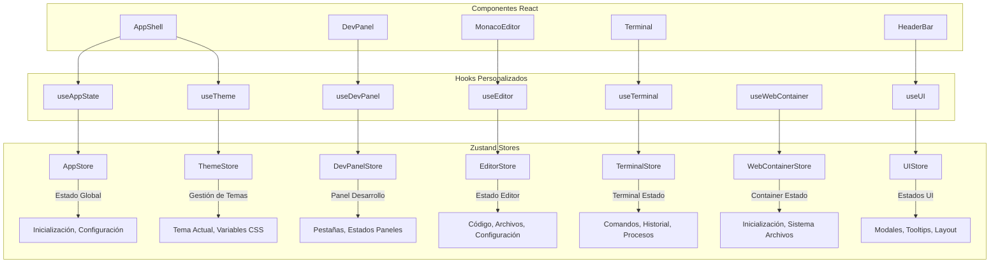

# Integración de Zustand para Gestión de Estados Globales en CheeseJS

## Visión General

Este diseño presenta la implementación de Zustand como solución de gestión de estado global para cheeseJS, reemplazando la arquitectura actual basada en servicios singleton y event bus. La integración eliminará el prop drilling, reducirá la duplicación de código y proporcionará una gestión de estado más predecible y escalable.

### Objetivos Principales

- **Eliminación del Prop Drilling**: Estado accesible desde cualquier componente sin pasar props
- **Comunicación Simplificada**: Reemplazar el sistema de eventos por estado reactivo
- **Reducción de Duplicación**: Consolidar lógica de estado dispersa en hooks personalizados
- **Mantenibilidad**: Estado centralizado y predecible con DevTools integradas
- **Rendimiento**: Actualizaciones optimizadas y re-renders selectivos

## Arquitectura de Estados con Zustand

### Estructura de Stores

El sistema implementará múltiples stores especializados siguiendo el principio de separación de responsabilidades:



### Definición de Stores

#### 1. AppStore - Estado Global de la Aplicación

```typescript
interface AppState {
  // Estado de inicialización
  isInitialized: boolean;
  isLoading: boolean;
  initializationError: string | null;
  
  // Configuración global
  config: {
    layout: {
      showConsole: boolean;
      consoleHeight: number;
      toolbarCollapsed: boolean;
    };
    editor: {
      fontSize: number;
      tabSize: number;
      wordWrap: boolean;
    };
    general: {
      language: string;
      theme: string;
      autoSave: boolean;
    };
  };
  
  // Acciones
  initialize: () => Promise<void>;
  setConfig: (path: string, value: any) => void;
  getConfig: (path: string, defaultValue?: any) => any;
  reset: () => void;
}
```

#### 2. ThemeStore - Gestión de Temas

```typescript
interface ThemeState {
  // Estado del tema
  currentTheme: string;
  availableThemes: Theme[];
  customThemes: Map<string, Theme>;
  isLoading: boolean;
  themeVariables: Record<string, string>;
  
  // Acciones
  setTheme: (themeName: string) => Promise<void>;
  toggleTheme: () => Promise<void>;
  createCustomTheme: (name: string, variables: Record<string, string>) => void;
  deleteCustomTheme: (name: string) => void;
  getThemeVariable: (variableName: string) => string;
  isDarkTheme: () => boolean;
}
```

#### 3. DevPanelStore - Estados del Panel de Desarrollo

```typescript
interface DevPanelState {
  // Estado de paneles
  activeTab: string;
  availablePanels: Panel[];
  panelStates: Map<string, any>;
  isInitialized: boolean;
  
  // Registro de paneles
  registeredPanels: Map<string, PanelDefinition>;
  
  // Acciones
  switchTab: (tabId: string) => void;
  registerPanel: (panel: PanelDefinition) => void;
  unregisterPanel: (panelId: string) => void;
  updatePanelState: (panelId: string, updates: any) => void;
  getPanelState: (panelId: string) => any;
  executePanelAction: (panelId: string, actionId: string, params?: any) => boolean;
}
```

#### 4. EditorStore - Estado del Editor

```typescript
interface EditorState {
  // Estado del código
  currentCode: string;
  hasUnsavedChanges: boolean;
  currentFile: string | null;
  openFiles: Map<string, FileState>;
  
  // Configuración del editor
  editorOptions: {
    language: string;
    theme: string;
    fontSize: number;
    tabSize: number;
    wordWrap: boolean;
  };
  
  // Ejecución
  isExecuting: boolean;
  lastExecutionResult: ExecutionResult | null;
  
  // Acciones
  setCode: (code: string) => void;
  saveFile: (path?: string) => Promise<void>;
  openFile: (path: string) => Promise<void>;
  closeFile: (path: string) => void;
  executeCode: () => Promise<ExecutionResult>;
  setEditorOption: (key: string, value: any) => void;
}
```

#### 5. TerminalStore - Estado del Terminal

```typescript
interface TerminalState {
  // Estado de conexión
  isConnected: boolean;
  isInitialized: boolean;
  connectionError: string | null;
  
  // Estado del terminal
  history: TerminalEntry[];
  currentCommand: string;
  isExecuting: boolean;
  
  // Configuración
  dimensions: { cols: number; rows: number };
  
  // Acciones
  connect: () => Promise<void>;
  disconnect: () => void;
  executeCommand: (command: string) => Promise<void>;
  clearHistory: () => void;
  addToHistory: (entry: TerminalEntry) => void;
  setDimensions: (dimensions: { cols: number; rows: number }) => void;
}
```

#### 6. WebContainerStore - Estado del WebContainer

```typescript
interface WebContainerState {
  // Estado de inicialización
  isInitialized: boolean;
  isInitializing: boolean;
  initializationError: string | null;
  
  // Sistema de archivos
  fileSystem: Map<string, FileNode>;
  currentDirectory: string;
  
  // Procesos
  runningProcesses: Map<string, Process>;
  
  // Paquetes instalados
  installedPackages: Map<string, PackageInfo>;
  
  // Acciones
  initialize: () => Promise<void>;
  writeFile: (path: string, content: string) => Promise<void>;
  readFile: (path: string) => Promise<string>;
  installPackage: (packageName: string, version?: string) => Promise<void>;
  runCommand: (command: string) => Promise<CommandResult>;
  getSystemStats: () => Promise<SystemStats>;
}
```

#### 7. UIStore - Estados de la Interfaz

```typescript
interface UIState {
  // Modales
  activeModal: string | null;
  modalData: any;
  modalStack: string[];
  
  // Notificaciones
  notifications: Notification[];
  
  // Layout
  sidebarCollapsed: boolean;
  consoleVisible: boolean;
  consoleHeight: number;
  
  // Loading states
  loadingStates: Map<string, boolean>;
  
  // Acciones
  openModal: (modalId: string, data?: any) => void;
  closeModal: () => void;
  closeAllModals: () => void;
  addNotification: (notification: Notification) => void;
  removeNotification: (id: string) => void;
  setLoading: (key: string, isLoading: boolean) => void;
  toggleSidebar: () => void;
  toggleConsole: () => void;
  setConsoleHeight: (height: number) => void;
}
```

## Implementación de Stores

### Store Base con Configuración Común

```typescript
// stores/base-store.ts
import { StateCreator } from 'zustand';
import { devtools, persist } from 'zustand/middleware';

export const createBaseStore = <T>(
  name: string,
  storeCreator: StateCreator<T>,
  options: {
    persist?: boolean;
    devtools?: boolean;
    persistKey?: string;
  } = {}
) => {
  let store = storeCreator;

  if (options.devtools !== false) {
    store = devtools(store, { name });
  }

  if (options.persist) {
    store = persist(store, {
      name: options.persistKey || name.toLowerCase(),
      partialize: (state) => {
        // Solo persistir propiedades específicas, no funciones
        const persistedState = { ...state };
        Object.keys(persistedState).forEach(key => {
          if (typeof persistedState[key] === 'function') {
            delete persistedState[key];
          }
        });
        return persistedState;
      }
    });
  }

  return store;
};
```

### Ejemplo de Implementación: ThemeStore

```typescript
// stores/theme-store.ts
import { create } from 'zustand';
import { createBaseStore } from './base-store';
import { themeService } from '../services/theme-service';

export const useThemeStore = create(
  createBaseStore<ThemeState>(
    'ThemeStore',
    (set, get) => ({
      // Estado inicial
      currentTheme: 'light',
      availableThemes: [],
      customThemes: new Map(),
      isLoading: true,
      themeVariables: {},

      // Acciones
      setTheme: async (themeName: string) => {
        try {
          set({ isLoading: true });
          await themeService.setTheme(themeName);
          
          set({
            currentTheme: themeName,
            themeVariables: themeService.getCurrentThemeVariables(),
            isLoading: false
          });
        } catch (error) {
          console.error('Error setting theme:', error);
          set({ isLoading: false });
        }
      },

      toggleTheme: async () => {
        const { currentTheme } = get();
        const newTheme = currentTheme === 'light' ? 'dark' : 'light';
        await get().setTheme(newTheme);
      },

      createCustomTheme: (name: string, variables: Record<string, string>) => {
        const { customThemes } = get();
        const newCustomThemes = new Map(customThemes);
        newCustomThemes.set(name, { name, variables });
        
        set({ customThemes: newCustomThemes });
      },

      deleteCustomTheme: (name: string) => {
        const { customThemes } = get();
        const newCustomThemes = new Map(customThemes);
        newCustomThemes.delete(name);
        
        set({ customThemes: newCustomThemes });
      },

      getThemeVariable: (variableName: string) => {
        const { themeVariables } = get();
        return themeVariables[variableName] || '';
      },

      isDarkTheme: () => {
        const { currentTheme } = get();
        return currentTheme === 'dark';
      }
    }),
    {
      persist: true,
      persistKey: 'cheesejs-theme',
      devtools: true
    }
  )
);
```

## Hooks Personalizados Optimizados

### Hook de Tema Simplificado

```typescript
// hooks/use-theme.ts
import { useThemeStore } from '../stores/theme-store';
import { useShallow } from 'zustand/react/shallow';

export const useTheme = () => {
  // Selección optimizada de estado para evitar re-renders innecesarios
  const {
    currentTheme,
    isLoading,
    themeVariables,
    setTheme,
    toggleTheme,
    isDarkTheme,
    getThemeVariable
  } = useThemeStore(
    useShallow((state) => ({
      currentTheme: state.currentTheme,
      isLoading: state.isLoading,
      themeVariables: state.themeVariables,
      setTheme: state.setTheme,
      toggleTheme: state.toggleTheme,
      isDarkTheme: state.isDarkTheme,
      getThemeVariable: state.getThemeVariable
    }))
  );

  return {
    currentTheme,
    isLoading,
    themeVariables,
    setTheme,
    toggleTheme,
    isDarkTheme: isDarkTheme(),
    getThemeVariable,
    isReady: !isLoading
  };
};
```

### Hook Compuesto para Estados Relacionados

```typescript
// hooks/use-dev-environment.ts
import { useAppStore } from '../stores/app-store';
import { useEditorStore } from '../stores/editor-store';
import { useTerminalStore } from '../stores/terminal-store';
import { useWebContainerStore } from '../stores/webcontainer-store';
import { useShallow } from 'zustand/react/shallow';

export const useDevEnvironment = () => {
  // Combinar múltiples stores de manera optimizada
  const appState = useAppStore(
    useShallow((state) => ({
      isInitialized: state.isInitialized,
      isLoading: state.isLoading
    }))
  );

  const editorState = useEditorStore(
    useShallow((state) => ({
      currentCode: state.currentCode,
      hasUnsavedChanges: state.hasUnsavedChanges,
      executeCode: state.executeCode
    }))
  );

  const terminalState = useTerminalStore(
    useShallow((state) => ({
      isConnected: state.isConnected,
      executeCommand: state.executeCommand
    }))
  );

  const containerState = useWebContainerStore(
    useShallow((state) => ({
      isInitialized: state.isInitialized,
      installPackage: state.installPackage
    }))
  );

  // Función compuesta para ejecutar código con dependencias
  const executeCodeWithDependencies = async (code: string) => {
    if (!containerState.isInitialized) {
      throw new Error('WebContainer no está inicializado');
    }

    return await editorState.executeCode();
  };

  return {
    isReady: appState.isInitialized && containerState.isInitialized,
    isLoading: appState.isLoading,
    hasUnsavedChanges: editorState.hasUnsavedChanges,
    isTerminalConnected: terminalState.isConnected,
    executeCodeWithDependencies,
    installPackage: containerState.installPackage,
    executeCommand: terminalState.executeCommand
  };
};
```

## Migración de Componentes

### Antes: Componente con Props Drilling

```typescript
// Antes - Con props y event bus
const DevPanel = ({ 
  activeTab, 
  onTabChange, 
  panels, 
  panelStates, 
  onPanelAction 
}) => {
  const [localState, setLocalState] = useState({});
  
  useEffect(() => {
    const unsubscribe = eventBus.subscribe('panel:update', handleUpdate);
    return unsubscribe;
  }, []);

  const handleUpdate = (data) => {
    // Lógica compleja de actualización
    setLocalState(prev => ({ ...prev, ...data }));
  };

  // Resto del componente...
};
```

### Después: Componente con Zustand

```typescript
// Después - Con Zustand
const DevPanel = () => {
  const {
    activeTab,
    availablePanels,
    switchTab,
    updatePanelState,
    getPanelState,
    executePanelAction
  } = useDevPanel();

  // Sin useState local, sin useEffect para eventos
  // Estado completamente manejado por Zustand

  const handleTabAction = (tabId: string, actionId: string, params = {}) => {
    executePanelAction(tabId, actionId, params);
  };

  // Resto del componente simplificado...
};
```

### Patrón de Componente Optimizado

```typescript
// Componente con selección específica de estado
const TerminalPanel = () => {
  // Solo se re-renderiza si cambian estas propiedades específicas
  const { history, isExecuting, executeCommand } = useTerminalStore(
    useShallow((state) => ({
      history: state.history,
      isExecuting: state.isExecuting,
      executeCommand: state.executeCommand
    }))
  );

  const handleCommand = useCallback(async (command: string) => {
    await executeCommand(command);
  }, [executeCommand]);

  return (
    <div className="terminal-panel">
      <TerminalOutput history={history} />
      <TerminalInput 
        onExecute={handleCommand} 
        disabled={isExecuting}
      />
    </div>
  );
};
```

## Integración con Servicios Existentes

### Adaptador para Servicios Legacy

```typescript
// adapters/service-adapter.ts
export class ServiceAdapter {
  static connectThemeService(themeStore: any) {
    // Escuchar cambios del servicio legacy
    themeService.on('theme:changed', (data) => {
      themeStore.getState().setTheme(data.to);
    });

    // Sincronizar cambios del store al servicio
    themeStore.subscribe((state, prevState) => {
      if (state.currentTheme !== prevState.currentTheme) {
        themeService.setTheme(state.currentTheme);
      }
    });
  }

  static connectWebContainerService(containerStore: any) {
    webContainerService.on('initialized', () => {
      containerStore.getState().setInitialized(true);
    });

    webContainerService.on('file:changed', (data) => {
      containerStore.getState().updateFileSystem(data.path, data.content);
    });
  }
}
```

### Inicialización con Migración Gradual

```typescript
// core/store-manager.ts
export class StoreManager {
  static async initialize() {
    // Inicializar stores
    await this.initializeStores();
    
    // Conectar servicios legacy
    await this.connectLegacyServices();
    
    // Migrar estado existente
    await this.migrateExistingState();
  }

  private static async initializeStores() {
    // Los stores se auto-inicializan con create()
    console.log('🏪 Stores inicializados');
  }

  private static async connectLegacyServices() {
    // Conectar servicios existentes como bridge durante migración
    ServiceAdapter.connectThemeService(useThemeStore);
    ServiceAdapter.connectWebContainerService(useWebContainerStore);
  }

  private static async migrateExistingState() {
    // Migrar configuración de localStorage
    const savedConfig = localStorage.getItem('cheesejs-config');
    if (savedConfig) {
      const config = JSON.parse(savedConfig);
      useAppStore.getState().setConfig('', config);
    }
  }
}
```

## Optimización de Rendimiento

### Selección de Estado Específica

```typescript
// ✅ Buena práctica - Selección específica
const MyComponent = () => {
  const currentTheme = useThemeStore((state) => state.currentTheme);
  const setTheme = useThemeStore((state) => state.setTheme);
  
  // Solo se re-renderiza si currentTheme cambia
};

// ❌ Mala práctica - Selección de todo el estado
const MyComponent = () => {
  const themeStore = useThemeStore(); // Se re-renderiza con cualquier cambio
};
```

### Uso de useShallow para Objetos

```typescript
// ✅ Comparación superficial para objetos
const MyComponent = () => {
  const { theme, isLoading, setTheme } = useThemeStore(
    useShallow((state) => ({
      theme: state.currentTheme,
      isLoading: state.isLoading,
      setTheme: state.setTheme
    }))
  );
};
```

### Acciones Memoizadas

```typescript
// ✅ Acciones estables entre re-renders
const useStableActions = () => {
  const executeCode = useEditorStore((state) => state.executeCode);
  const setTheme = useThemeStore((state) => state.setTheme);
  
  return useMemo(() => ({
    executeCode,
    setTheme
  }), [executeCode, setTheme]);
};
```

## DevTools y Debugging

### Configuración de DevTools

```typescript
// stores/devtools-config.ts
export const devToolsOptions = {
  name: 'CheeseJS State',
  serialize: {
    options: {
      // Configuración de serialización para DevTools
      undefined: true,
      function: true,
      map: true
    }
  },
  actionSanitizer: (action: string, state: any) => {
    // Sanitizar acciones sensibles
    if (action.includes('password') || action.includes('token')) {
      return { ...action, payload: '[REDACTED]' };
    }
    return action;
  },
  stateSanitizer: (state: any) => {
    // Sanitizar estado sensible
    const sanitized = { ...state };
    if (sanitized.auth?.token) {
      sanitized.auth.token = '[REDACTED]';
    }
    return sanitized;
  }
};
```

### Logging Personalizado

```typescript
// middleware/logger.ts
export const logger = (config) => (set, get, api) =>
  config(
    (...args) => {
      console.group(`🏪 Store Update: ${api.getState().constructor.name}`);
      console.log('Previous State:', get());
      set(...args);
      console.log('New State:', get());
      console.groupEnd();
    },
    get,
    api
  );
```

## Estructura de Archivos

```
src/
├── stores/
│   ├── app-store.ts
│   ├── theme-store.ts
│   ├── dev-panel-store.ts
│   ├── editor-store.ts
│   ├── terminal-store.ts
│   ├── webcontainer-store.ts
│   ├── ui-store.ts
│   ├── base-store.ts
│   └── index.ts
├── hooks/
│   ├── use-theme.ts
│   ├── use-dev-panel.ts
│   ├── use-editor.ts
│   ├── use-terminal.ts
│   ├── use-webcontainer.ts
│   ├── use-ui.ts
│   ├── use-app-state.ts
│   ├── use-dev-environment.ts (compuesto)
│   └── index.ts
├── adapters/
│   ├── service-adapter.ts
│   └── legacy-bridge.ts
├── middleware/
│   ├── logger.ts
│   ├── persistence.ts
│   └── devtools-config.ts
└── types/
    ├── store-types.ts
    └── state-interfaces.ts
```

## Plan de Migración

### Fase 1: Configuración Base
1. **Instalación de Zustand**: `npm install zustand`
2. **Configuración de stores base**: Implementar `base-store.ts` y tipos
3. **Store inicial**: Implementar `AppStore` como prueba de concepto

### Fase 2: Migración por Módulos
1. **ThemeStore**: Migrar gestión de temas (menor complejidad)
2. **UIStore**: Migrar estados de modales y layout
3. **DevPanelStore**: Migrar sistema de paneles

### Fase 3: Integración Completa
1. **EditorStore**: Migrar gestión de código y archivos
2. **TerminalStore**: Migrar gestión del terminal
3. **WebContainerStore**: Migrar gestión del contenedor

### Fase 4: Optimización
1. **Cleanup**: Remover servicios legacy obsoletos
2. **Performance**: Optimizar selecciones de estado
3. **DevTools**: Configurar debugging completo

## Beneficios Esperados

### Eliminación de Prop Drilling
- **Antes**: Props pasados a través de 3-4 niveles de componentes
- **Después**: Estado accesible directamente donde se necesita

### Reducción de Código Duplicado
- **Antes**: Lógica de estado repetida en múltiples hooks personalizados
- **Después**: Lógica centralizada en stores con hooks simplificados

### Mejor Performance
- **Antes**: Re-renders innecesarios por cambios en event bus
- **Después**: Re-renders optimizados por selección específica de estado

### DevTools Integradas
- **Antes**: Debugging complejo con console.log y event tracing
- **Después**: DevTools nativas con time-travel debugging

### Predictibilidad
- **Antes**: Estado distribuido entre servicios, hooks y componentes
- **Después**: Flujo unidireccional y estado centralizado predecible